<h1 align="center">Hi 👋, I'm Vo Nguyen Thanh Tu</h1>

- ✍ I'm a student of: [Industrial University of Ho Chi Minh City](https://iuh.edu.vn/).
- ✍ Subject : WWW với Công nghệ java
- ✍ Content: Nội dung bài tập tuần 1

 

# 📒Hoạt độnng:
<table style="width:100%;">
  <tr>
    <td>
      
      
    </td>
    <td>
      
 
        
      

    </td>
  </tr>
</table>

# 📒Kĩ năng áp dụng trong Project :

  
  
  
  

# 📒Yêu cầu Project :

  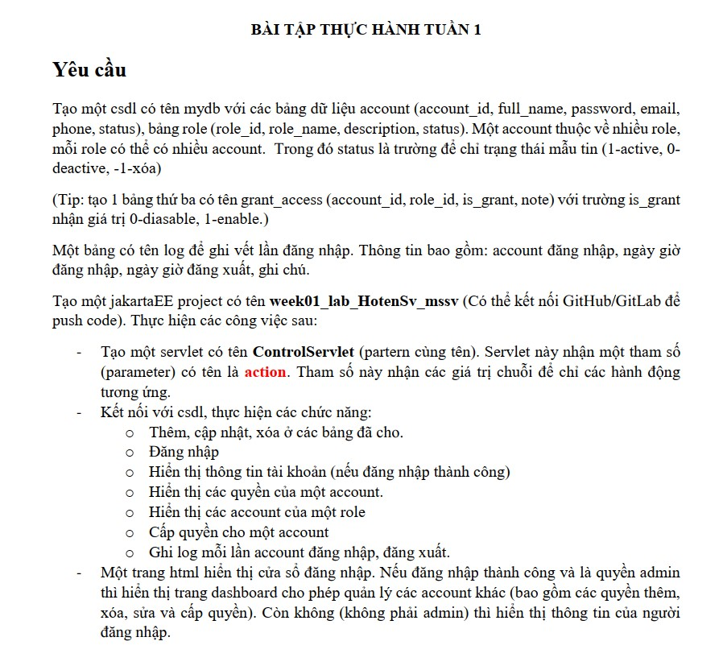

# 😍Trình bày về project:
## 📚Tạo một servlet có tên ControlServlet (partern cùng tên). Servlet này nhận một tham số (parameter) có tên là action.
- ✍Em đã tạo ra một servlet có tên ControlServle sử dụng cho **doGet** và **doPost**
<table style="width:100%;">
  <tr>
    <td>
      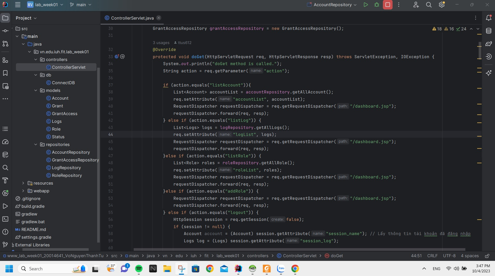
    <td>
      
  </tr>
</table>

## 📚 Một trang html hiển thị cửa sổ đăng nhập. Nếu đăng nhập thành công và là quyền admin thì hiển thị trang dashboard cho phép quản lý các account khác (bao gồm các quyền thêm, xóa, sửa và cấp quyền). Còn không (không phải admin) thì hiển thị thông tin của người đăng nhập.
### 🧑‍💻Admin
 1. ✍Login: Đăng nhập với tài khoản "nguyenvanb@gmail.com" , password "123" là tài khoản admin
  

    
Login

    
2. ✍Dasboard admin: Khi đăng nhập thành công thì thanh menu đầy đủ các chức năng khác của 1 admin mà yêu cầu đưa ra như: quản lí account, log, ...
  

    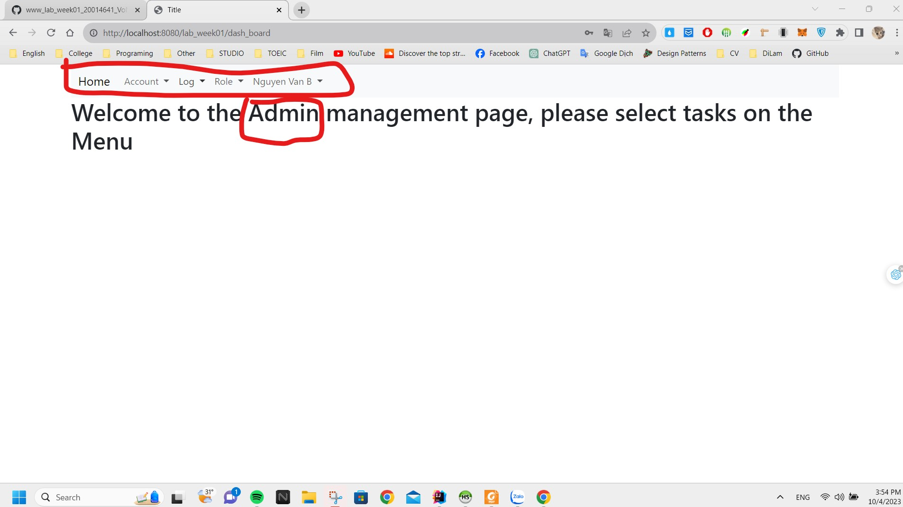
  

3. ✍Cấp quyền cho một account: Khi thêm thì admin có thẻ chọn 1 hoặc nhiều role cho 1 account
  

    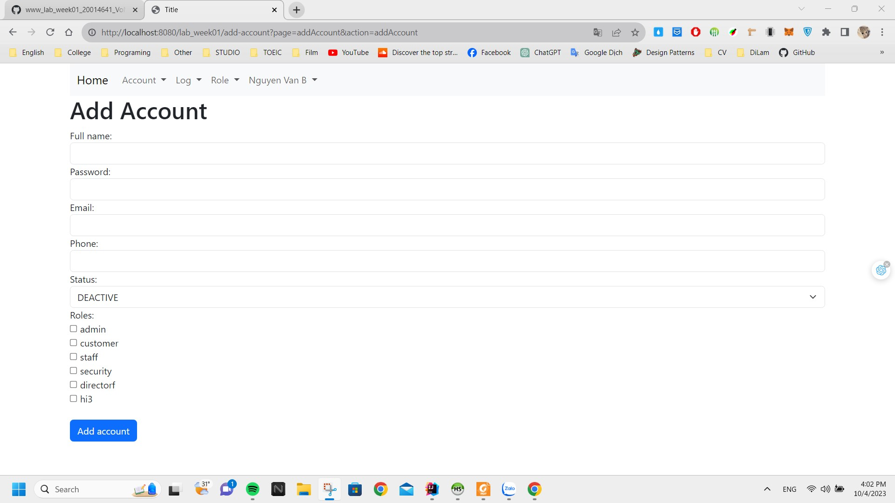
  

4. ✍Hiển thị các quyền của một account: Khi chọn chức năng này nó sẽ hiển thị lên danh sách tất cả các quyền của một account được cấp quyền, nếu ta muốn lọc theo account nào đó ta chỉ cần chọn giá trị trong select và nhấn nút là nó sẽ lấy ra tất cả các quyền mà account đó sở hữu
  

    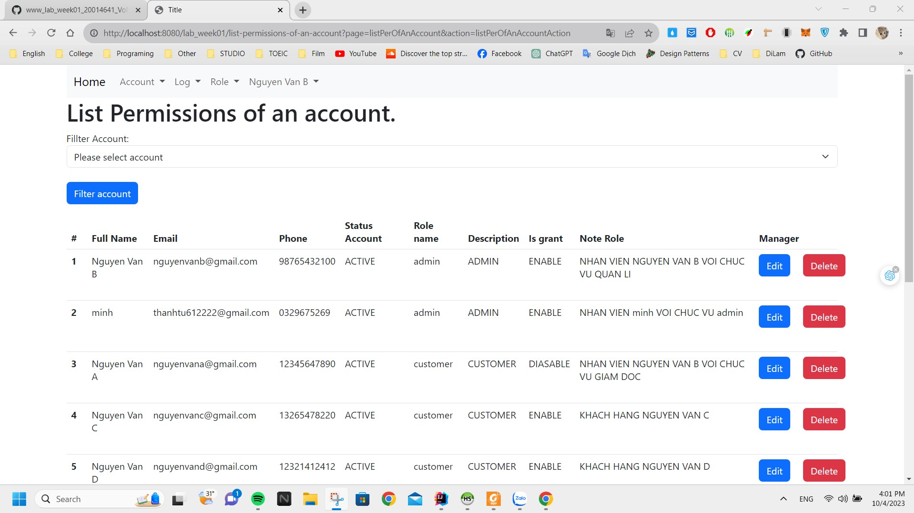
    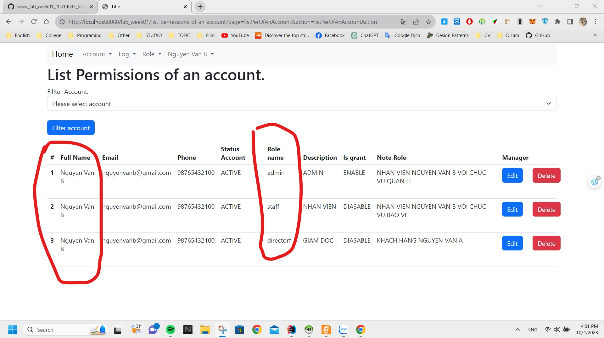
  

5. ✍Hiển thị các account của một role: Khi chọn chức năng này nó sẽ hiển thị lên danh sách tất cả các account của role, nếu ta muốn lọc theo role nào đó ta chỉ cần chọn giá trị trong select và nhấn nút là nó sẽ lấy ra tất cả các account tương ứng với role đó
 

    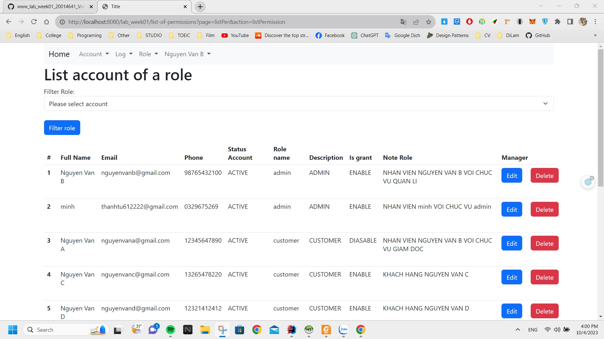
    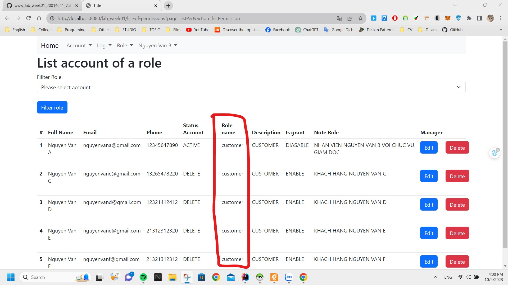
  

  6. ✍Các chức năng CRUD và lấy danh sách(Theo em trong đây chỉ có phầnt role và phần account thì chỉ cần thôi ạ, Phần log thì nó sẽ được tự động cập nhật)
 

    
    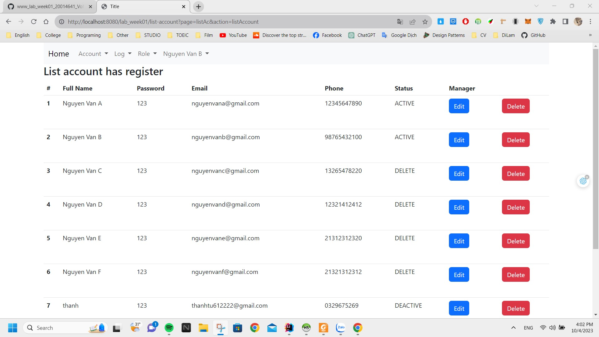
    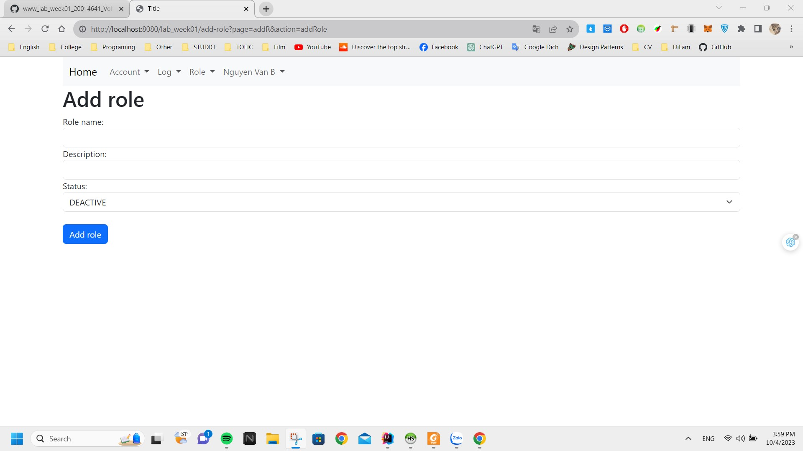
    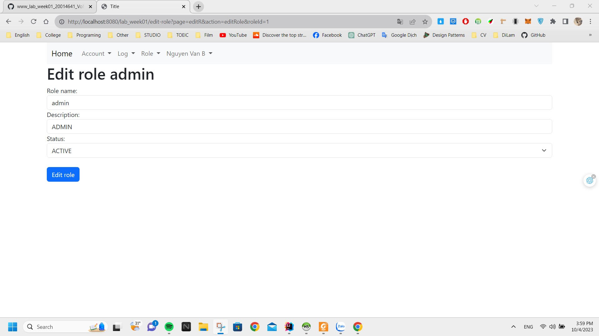
    
Khi xóa sẽ chuyển sang trạng thái diasable chứ không xóa ra khỏi danh sách

    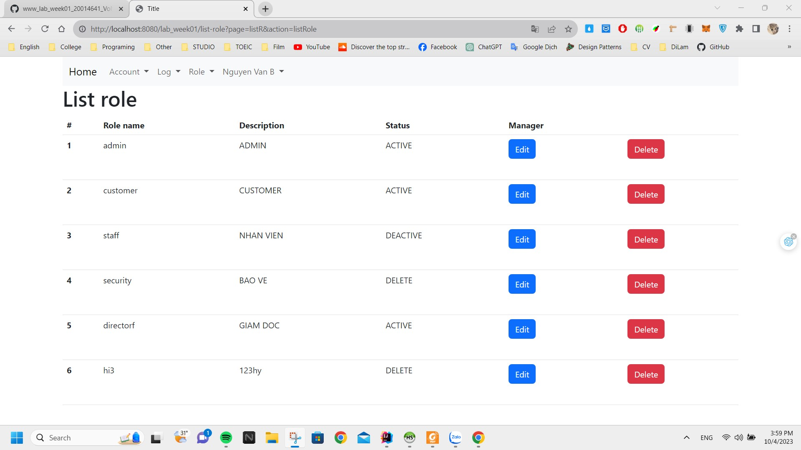

  

### 👨‍🦱Không phải là admin:
  1. ✍Login: Đăng nhập với tài khoản "nguyenvana@gmail.com" , password "123" không phải là tài khoản admin
  

    
Login

    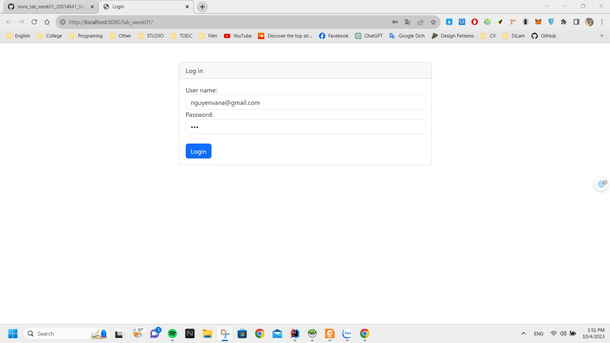
    
Login success

    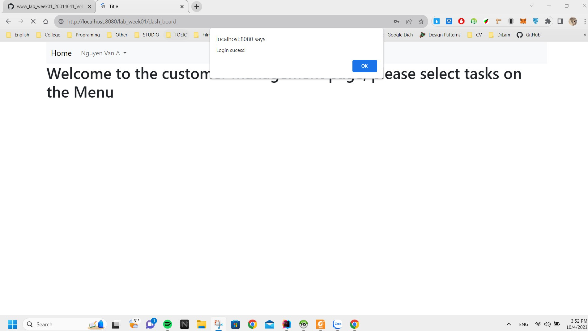
  

  2. ✍Dasboard không phải admin: Khi đăng nhập thành công thì thanh menu của phần user chỉ có thể xem được thông tin của họ và không có các chức năng khác của 1 admin
  

    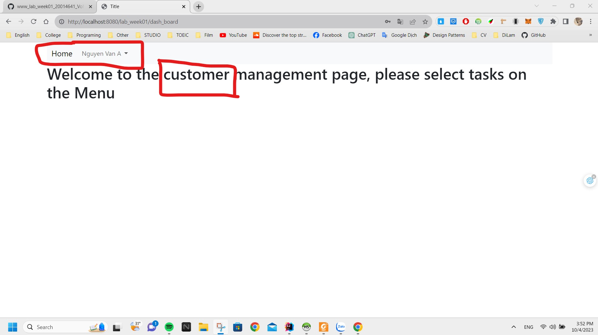
    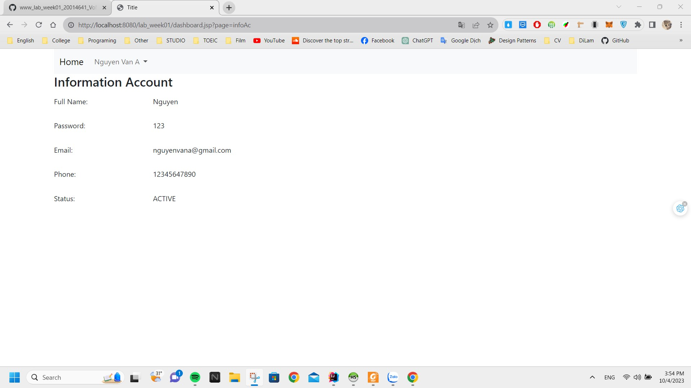
  

  
### 🖊️Ghi Log:
Khi user hoặc admin login vào hệ thống thì hệ thống sẽ tự động ghi lại Log mà người đó đã đăng nhập vào hệ thống, Khi đăng xuất thì hệ thống sẽ cập nhật lại thời gian logout còn nếu chưa nó sẽ mặc định là null
  

    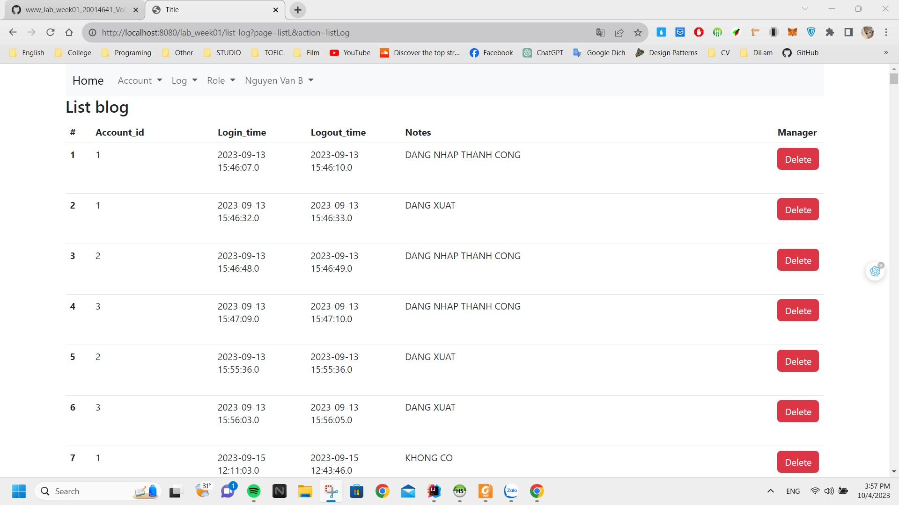
    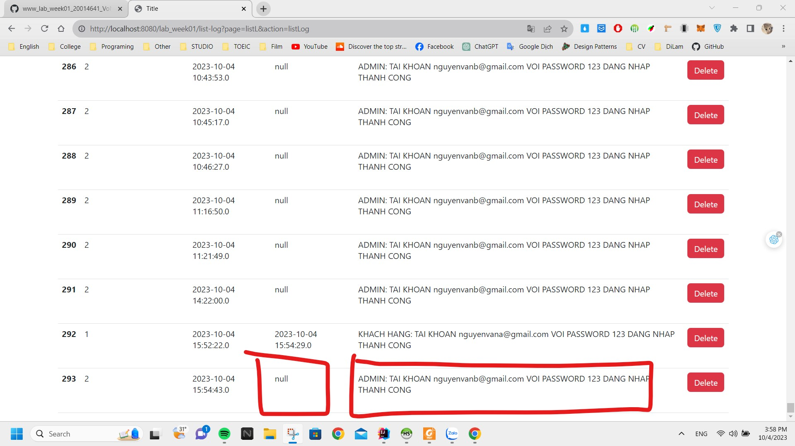
  

